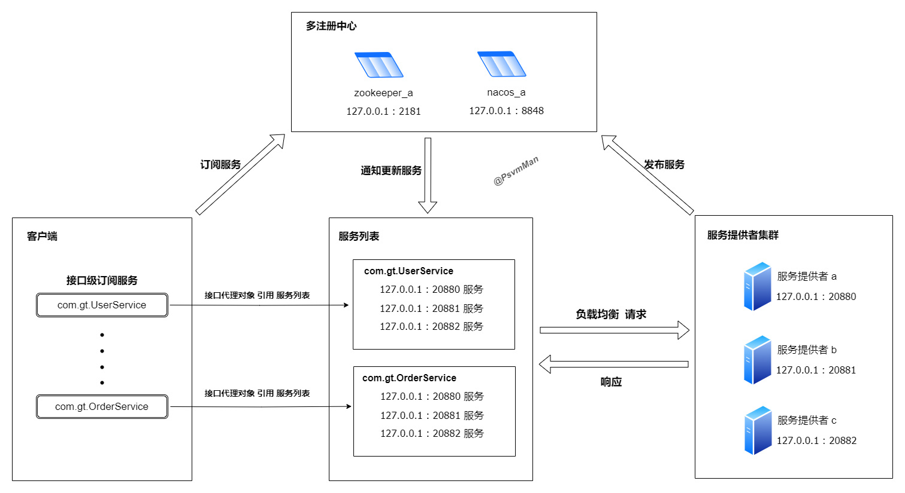

# 🚀 Lio RPC 1.0.0

> 简洁、高效、可扩展的高性能 RPC 框架，适用于微服务架构下的服务通信场景。

[](https://github.com/PsvmMan/lio-rpc)
[](LICENSE)

---

## 📌 目录

1. [简介](#简介)
2. [核心特性](#核心特性)
3. [整体架构](#整体架构)
4. [模块划分](#模块划分)
5. [快速入门](#快速入门)
6. [功能详解](#功能详解)
7. [设计理念](#设计理念)
8. [开发计划](#开发计划)
9. [贡献代码](#贡献代码)
10. [许可证](#许可证)
11. [联系方式](#联系方式)
12. [致谢](#致谢)

---

## 简介

Lio RPC 是一个轻量级但功能强大的 Java 远程过程调用（Remote Procedure Call）框架，旨在为开发者提供高性能、高可用性以及低侵入性的服务间通信解决方案。该框架特别适用于构建分布式系统和微服务架构，提供了丰富的功能支持和服务治理能力。

该项目是我个人学习与实践过程中逐步构建的 RPC 框架，目前具备基础功能并持续迭代中。

---

## 核心特性

- ✅ 调用方式：同步调用、异步回调、单向调用、多路竞速调用
- ✅ 参数配置：配置文件(全局参数配置)、注解(接口级参数配置、方法级参数配置)
- ✅ 通信协议：提供了性能高效的lio通信协议，并且支持自定义扩展通信协议
- ✅ 序列化：提供了 Hessian、Kryo、JDK 等序列化方式，并且支持自定义扩展序列化方式
- ✅ 解压缩：对大数据场景提供了 gzip、zstd 等序列化方式，并且支持自定义扩展解压缩方式
- ✅ 负载均衡：提供了加权随机、一致性哈希等负载均衡策略，并且支持自定义扩展负载均衡策略
- ✅ 服务注册与发现：提供了 Zookeeper、Nacos 注册中心插件，并且支持自定义扩展注册中心插件
- ✅ 服务上下线动态感知：实时监控服务状态变化，确保服务列表的准确性与时效性。
- ✅ 客户端容错机制：支持降级处理、失败重试
- ✅ 流量控制：客户端支持滑动窗口、漏桶、令牌桶等限流方式，并且支持自定义扩展流量控制方式
- ✅ 集群策略：支持快速失败、失败重试、多路竞速等集群策略，并且支持自定义扩展集群策略
- ✅ 业务线程池：支持多业务线程池，保证业务处理隔离，并且支持自定义扩展业务线程池
- ✅ 高性能 IO：基于 Netty 实现异步非阻塞通信
- ✅ 可插拔设计：提供SPI机制，使系统功能模块解耦，易于二次开发与扩展
- ✅ 提供了对 Spring 和 Spring Boot 的原生集成支持

---

## 整体架构



该框架采用典型的 RPC 分层架构，主要包括以下几个部分：

- **注册中心**：服务注册与发现，主要作用就是发布服务、订阅服务、通知更新服务
- **消费者**：以接口为维度，订阅多注册中心的服务，并且可以获取实时的服务列表，并实现负载均衡与容错机制
- **提供者**：以接口为维度，发布服务到多注册中心

---

## 模块划分

本项目采用模块化设计，主要模块如下：

| 模块名                 | 描述                                               |
|---------------------|--------------------------------------------------|
| `lio-common`        | 公共工具类、常量定义、SPI机制                                 |
| `lio-config`        | 服务导出导入、配置中心模块，支持 YAML、Properties、配置Bean 等方式加载配置。 |                                 |
| `lio-protocol`      | 通信协议模块，支持自定义扩展通信协议                               |
| `lio-serialization` | 序列化模块，支持自定义扩展序列化方式                               |                                      |
| `lio-compression`   | 解压缩模块，支持自定义扩展解压缩方式                               |                                      |                                              |                                      |
| `lio-remote`        | 传输层模块，支持自定义传输层逻辑                                 |                                      |                                               |
| `lio-registry`      | 服务注册与发现模块，支持 Zookeeper、Nacos，支持自定义扩展注册中心         |
| `lio-cluster`       | 集群容错模块：负载均衡、故障转移                                 |
| `lio-limiter`       | 流量控制模块，支持自定义扩展流量控制方式                             |
| `lio-core`          | 集成模块，提供对Spring 和 Spring Boot 的原生集成支持                                          |

---

## 快速入门


### ✅ 添加依赖（Maven 示例）

```xml
<dependencies>
    
    <!-- Lio框架核心依赖 -->
    <dependency>
        <groupId>com.gt.lio</groupId>
        <artifactId>lio-core</artifactId>
        <version>1.0.0</version>
    </dependency>

    <!-- zookeeper作为注册中心 -->
    <dependency>
        <groupId>com.gt.lio</groupId>
        <artifactId>lio-register-zookeeper</artifactId>
        <version>1.0.0</version>
    </dependency>

    <!-- 使用lio通信协议 -->
    <dependency>
        <groupId>com.gt.lio</groupId>
        <artifactId>lio-protocol-lio</artifactId>
        <version>1.0.0</version>
    </dependency>
    
</dependencies>
```

### 🛠️ 配置服务

接下来，需要对应用程序进行一些基本配置。可以在 application.yml 或 application.properties 文件中进行配置。这里以 application.yml 为例：
```yaml
#生产者
lio:
  #服务配置
  application:
    name: provider #服务名称
    version: 1.0.0 #服务版本
    group: dev #服务分组
  #通信协议配置
  protocol:
    name: lio #通信协议名称
    port: 20880 #通信端口
    serialization: hessian #序列化方式
  #注册中心配置
  registry:
    type: zookeeper #注册中心类型
    address: 192.168.204.130:2181 #注册中心地址
```

```yaml
#消费者
lio:
  #服务配置
  application:
    name: consumer #服务名称
    version: 1.0.0 #服务版本
    group: dev #服务分组
  #注册中心配置
  registry:
    type: zookeeper #注册中心类型
    address: 192.168.204.130:2181 #注册中心地址
```

### 📦 编写服务接口与实现
定义一个远程调用接口：
```java
public interface HelloService {
    String sayHello(String name);
}
```
在服务提供者中实现该接口：
```java
@LioService
public class HelloServiceImpl implements HelloService {
    @Override
    public String sayHello(String name) {
        return "Hello, " + name + "!";
    }
}
```

### 🔌 启动 RPC 服务
```java
@SpringBootApplication
@LioEnable
public class RpcProviderApplication {
    public static void main(String[] args) {
        SpringApplication.run(RpcProviderApplication.class, args);
    }
}
```

### 📞 调用远程服务
在消费者端注入远程服务并调用：
```java
@RestController
public class HelloController {

    @LioReference
    private HelloService helloService;

    @GetMapping("/hello")
    public String hello(@RequestParam String name) {
        return helloService.sayHello(name);
    }
}
```
启动消费者服务：
```java
@SpringBootApplication
@LioEnable
public class RpcConsumerApplication {
    public static void main(String[] args) {
        SpringApplication.run(RpcProviderApplication.class, args);
    }
}
```

### 🧪 运行测试
启动服务提供者和消费者后，访问：
```
http://localhost:8080/hello?name=Lio
```
你会看到输出：
```
Hello, Lio!
```

---

## 功能详解
在功能详解中，我会先介绍一些基础性的功能模块，最后将整个框架进行串联，以展示整个框架的运行机制。

### 1. **SPI 机制**

Lio RPC 框架采用基于 JDK 原生 ServiceLoader 的 SPI（Service Provider Interface）机制，对核心组件进行统一管理和动态加载。通过封装 `LioServiceLoader` 工具类，实现了更加灵活、可扩展的服务发现与实例化机制。
不仅是Lio RPC，很多的框架都采用了SPI机制，比如Dubbo，理解SPI机制是框架源码学习的基础。

#### 📝 **主要特性：**

- **自动加载服务实现类**：支持自动扫描并加载接口的实现类，简化扩展组件的集成流程。
- **支持自定义服务名称与编码**：通过 `@SPIService` 注解，开发者可以为每个实现类指定服务名（name）和服务编号（code），便于协议层、序列化层等模块使用。
- **按名称或编码获取服务实例**：提供 `getService(String name)` 方法，以及 `getCodeByServiceName()` 和 `getServiceNameByCode()` 等方法，实现服务的双向映射。
- **线程安全与缓存优化**：使用 ConcurrentHashMap 缓存已加载的服务实例和映射关系，确保并发访问下的性能与一致性。
- **延迟加载机制**：服务实现在首次调用时才会被加载，减少启动开销。
- **兼容标准 SPI 规范**：保持与 JDK 原生 SPI 的兼容性，开发者只需在 `META-INF/services/` 目录下添加配置文件即可完成扩展注册。


#### 🎨 **SPIService 注解介绍：**

该注解用于标识一个服务实现类，它包含以下两个属性：
- **value**：服务名称，这个比较容易理解，例如我们配置序列化方式的时候，value就是序列化方式名称，例如：jdk、hessian、kryo
- **code**：服务编号，并不是所有使用SPI机制的服务都需要服务编号，序列化方式是需要服务编号的，例如：0x01、0x02、0x03等，因为在网络通信的时候，协议头中的序列化方式，通常是使用的编号表示，编号远比服务名称要短很多，所以需要服务编号。但是例如像负载均衡策略这种不需要网络传输的内容，不配置编号也没有关系的，默认为0x00，表示编码无作用。

#### 🛠️ **典型使用场景：**

- 序列化方式扩展（JDK、Hessian、Kryo）
- 负载均衡策略扩展（weightedRandom、consistentHash）
- 集群策略扩展（simple、retryOnFailure、parallel）
- 注册中心扩展（Zookeeper、Nacos）

#### 💡 **示例说明：**

以序列化方式扩展为例，当框架提供的序列化方式不满足时，开发者可以实现`Serialization`接口，并使用`@SPIService`注解进行扩展。注意：code值不能和框架提供的序列化方式冲突，且`0x00`是无效的，所以建议开发者按照已有的序列化方式编码值+1，例如：`0x04`。
```java
@SPIService(value = "json", code = 0x04)
public class JsonSerialization implements Serialization {

    @Override
    public <T> byte[] serialize(T obj) {
        // 序列化逻辑
    }

    @Override
    @SuppressWarnings("unchecked")
    public <T> T deserialize(byte[] bytes, Class<T> clazz) {
        // 反序列化逻辑
    }
}
```
然后在`META-INF/services/` 目录下添加配置文件`com.gt.lio.serialization.Serialization`，即可完成扩展注册，文件内容如下：
```
// 填写实现类的全限定名
xx.xx.xx.xx.xx.JsonSerialization
```
该机制极大提升了 Lio RPC 的可维护性和可扩展性，使得框架具备良好的插拔能力，方便开发者根据业务需求定制组件。

#### 📂 **源码位置：**
`lio-common`模块中：`com.gt.lio.common.spi` 包

---
### 2. **序列化**
Lio RPC 框架内置了对多种常见序列化方式的支持，开发者可根据性能需求和业务场景灵活选择。当前支持以下三种主流的序列化机制：
- JDK 原生序列化：Java 自带的默认序列化实现，兼容性强但性能较低，适用于开发调试或简单场景。
- Hessian：轻量级二进制序列化协议，具有良好的跨语言支持和较高的序列化效率，是默认选项。
- Kryo：高效的 Java 对象图序列化框架，特别适合对性能要求极高的场景，序列化速度优异。

#### 📋 **使用方式：**
你可通过配置指定使用哪种序列化方式，例如在 application.yml 中配置，注意：序列化方式只需要在服务提供方端配置即可，服务消费方会自动使用服务提供方配置的序列化方式。
```yaml
lio:
  protocol:
    name: lio #通信协议名称
    port: 20880 #通信端口
    serialization: hessian # 可选值：jdk / hessian / kryo
```

#### 🧩 **扩展性：**
Lio RPC 框架支持通过 SPI 扩展序列化方式，开发者可以自定义实现 `Serialization` 接口，并使用 `@SPIService` 注解指定序列化方式的名称，在 `META-INF/services/` 目录下添加配置文件 `com.gt.lio.serialization.Serialization`，并在配置文件中填入实现类的全限定类名，即可完成扩展注册。

#### 📂 **源码位置：**
`lio-serialization` 模块

---
### 3. **解压缩**
Lio RPC 框架支持在传输过程中对数据进行压缩和解压，以降低网络带宽消耗并提升整体通信效率。目前框架内置了以下两种主流压缩算法：

- GZIP：广泛使用的压缩算法，具有良好的通用性和压缩率，适用于大多数业务场景。
- ZSTD（Zstandard）：Facebook 开源的高性能压缩算法，在压缩速度和压缩率之间取得了良好平衡，尤其适合对性能要求较高的场景，是默认选项。

#### 📋 **使用方式**
因为解压缩这种需求一般都是方法级别的需求，所以框架提供了方法级别的注解来开启是否需要解压缩。解压缩的需求，可以细分为两种情况：一是服务消费者的请求数据特别大，需要进行压缩，二是服务提供者的响应数据特别大，需要进行压缩。

我们以`UserService`接口为例，它的`selectAll()`方法返回的数据量特别大，而`insert()`方法批量插入的入参数据量比较大。
```java
public interface UserService {

    List<User> selectAll();

    int insert(List<User> user);
}
```

首先站在服务提供者的角度来说，我们可以给`UserService`接口的`selectAll()`方法的返回结果进行压缩，使用`@LioServiceMethod`注解来开启压缩功能，可以指定压缩算法为，默认是`zstd`。
```java
public interface UserService {

    @LioServiceMethod(isCompressed = true, compressionType = "zstd")
    List<User> selectAll();

    int insert(List<User> user);
}
```

站在服务消费者的角度来说，我们可以给`UserService`接口的`insert()`方法的请求数据进行压缩，使用`@LioReferenceMethod`注解来开启压缩功能，可以指定压缩算法为，默认是`zstd`。
```java
public interface UserService {
    
    List<User> selectAll();
    
    @LioReferenceMethod(isCompressed = true, compressionType = "zstd")
    int insert(List<User> user);
}
```

#### 🧩 **扩展性**
Lio RPC 框架支持通过 SPI 扩展解压缩方式，开发者可以自定义实现 `Compression` 接口，并使用 `@SPIService` 注解指定解压缩方式的名称，在 `META-INF/services/` 目录下添加配置文件 `com.gt.lio.compression.Compression`，并在配置文件中填入实现类的全限定类名，即可完成扩展注册。


#### 📂 **源码位置：**
`lio-compression` 模块

---
### 4. **流量控制**
Lio RPC 框架内置了多种限流策略，旨在防止系统在高并发场景下因请求过载而崩溃，提升系统的稳定性和可用性。目前支持以下三种主流的限流算法：

- 令牌桶（Token Bucket）：以恒定速率向桶中添加令牌，请求需要获取令牌才能继续执行，适用于突发流量控制，是默认选项。
- 漏桶（Leaky Bucket）：将请求按固定速率处理，平滑流量输出，适用于对流量稳定性要求较高的场景。
- 滑动窗口（Sliding Window）：基于时间窗口统计请求数量，支持更细粒度的限流控制，精度更高。

当前版本仅支持客户端限流，即对客户端发起的请求进行频率限制，防止客户端向服务端发送过多请求导致雪崩效应。

#### 📋 **使用方式**
客户端的限流策略，提供的是方法级别的注解，以`UserService`接口为例，它的`selectById()`方法请求量特别大,我们可以给`UserService`接口的`selectById()`方法进行限流，使用`@LioRateLimit`注解来开启限流功能，可以指定限流算法为，默认是`token_bucket`，period为令牌补充周期，单位为毫秒，capacity为桶的初始容量，refillTokens为每次填充的令牌数量。

当然type类型还支持漏桶`leaky_bucket`、滑动窗口`sliding_window`，这三种类型的限流策略参数各有不同，同时还支持阻塞限流、超时限流，具体可参考源码。
```java
public interface UserService {

    @LioRateLimit(type = "token_bucket", period = 1000, capacity = 3, refillTokens = 1)
    User selectById(Long id);
    
}
```

#### 🧩 **扩展性**
Lio RPC 框架支持通过 SPI 扩展限流方式，开发者可以自定义实现 `RateLimiterFactory` 接口，并使用 `@SPIService` 注解指定限流方式的名称，在 `META-INF/services/` 目录下添加配置文件 `com.gt.lio.limiter.RateLimiterFactory`，并在配置文件中填入实现类的全限定类名，即可完成扩展注册。

#### 📂 **源码位置：**
`lio-limiter` 模块

---
### 5. **注册中心**

Lio RPC 框架支持多种主流的服务注册与发现机制，便于构建灵活、可扩展的微服务架构。目前框架已实现以下两种注册中心的集成支持：

- Zookeeper：基于 Apache Zookeeper 的分布式协调服务，具备高可用性和强一致性，适用于传统分布式系统。
- Nacos：阿里巴巴开源的服务发现与配置管理平台，支持动态服务注册与发现，适用于云原生和 Spring Cloud 生态。

注册中心在 Lio RPC 中用于服务提供者（Provider）和服务消费者（Consumer）之间的服务注册与发现，确保服务调用的动态感知和负载均衡能力。

#### 📋 **使用方式：**
你可通过配置指定使用哪些注册中心，支持配置多注册中心，例如在 application.yml 中配置，注意：服务消费者配置多个注册中心，代表从多个注册中心获取服务；服务提供者配置多个注册中心，代表服务提供者注册到多个注册中心。
```yaml
lio:
  registry:
    type: zookeeper 
    address: 192.168.204.130:2181 
```

#### 🧩 **扩展性：**
Lio RPC 框架支持通过 SPI 扩展注册中心插件，开发者可以自定义实现 `RegistryFactory` 接口，并使用 `@SPIService` 注解指定注册中心插件的名称，在 `META-INF/services/` 目录下添加配置文件 `com.gt.lio.register.RegistryFactory`，并在配置文件中填入实现类的全限定类名，即可完成扩展注册。

#### 📂 **源码位置：**
`lio-register` 模块

---
### 6. **负载均衡**
Lio RPC 框架提供了两种常见的负载均衡策略，帮助服务消费者在多个服务提供者之间进行合理的请求分发，提升系统整体性能与可用性。目前支持以下两种策略：

- 加权随机（Weighted Random）：根据服务实例配置的权重进行随机选择，权重越高被选中的概率越大，适用于服务器资源不均的场景，是默认选项。
- 一致性哈希（Consistent Hashing）：将服务调用者与服务提供者映射到哈希环上，尽量减少节点变动对路由的影响，适用于需要会话保持或缓存亲和性的场景。

#### 📋 **使用方式：**

- 全局配置：在 application.yml 中配置负载均衡策略。
```yaml
lio:
  consumer:
    loadbalance: weightedRandom # 全局配置负载均衡策略，支持weightedRandom、consistentHash
```

- 接口级配置：如果需要针对某个接口进行负载均衡策略配置，可以在`@LioReference` 注解中指定负载均衡策略。
```java
@RestController
public class HelloController {

    @LioReference(loadbalance = "consistentHash")
    private HelloService helloService;

    @GetMapping("/hello")
    public String hello(@RequestParam String name) {
        return helloService.sayHello(name);
    }
}
```

- 方法级配置：如果需要针对某个方法进行负载均衡策略配置，可以在`@LioReferenceMethod` 注解中指定负载均衡策略。
```java
public interface HelloService {
    
    @LioReferenceMethod(loadbalance = "weightedRandom")
    String sayHello(String name);
    
}
```

#### 🧩 **扩展性：**
Lio RPC 框架支持通过 SPI 扩展负载均衡策略，开发者可以自定义实现 `LoadBalance` 接口，并使用 `@SPIService` 注解指定负载均衡策略的名称，在 `META-INF/services/` 目录下添加配置文件 `com.gt.lio.cluster.loadbalance.LoadBalance`，并在配置文件中填入实现类的全限定类名，即可完成扩展注册。

#### 📂 **源码位置：**
`lio-cluster` 模块中的 `com.gt.lio.cluster.loadbalance` 包

---
### 7. **集群模式**
Lio RPC 框架支持多种集群调用策略，用于控制服务消费者在调用远程服务失败时的行为，提升系统的健壮性和可用性。目前提供了以下三种常见的集群容错策略：

- 失败直接返回：调用失败后立即抛出异常，适用于对响应时间敏感、无需重试的场景。
- 失败重试：在调用失败后自动切换其他可用服务实例进行重试，适用于幂等性接口调用。
- 竞速并发调用：同时向多个服务实例发起请求，取最先执行成功的结果作为最终结果，适用于对响应速度要求极高的场景。


#### 📋 **使用方式：**

- 全局配置：在 application.yml 中配置负载均衡策略。
```yaml
lio:
  consumer:
    cluster: simple # 全局配置集群策略，支持simple、retryOnFailure、parallel
```

- 接口级配置：如果需要针对某个接口进行集群策略配置，可以在`@LioReference` 注解中指定集群策略。
```java
@RestController
public class HelloController {

    @LioReference(cluster = "retryOnFailure")
    private HelloService helloService;

    @GetMapping("/hello")
    public String hello(@RequestParam String name) {
        return helloService.sayHello(name);
    }
}
```

- 方法级配置：如果需要针对某个方法进行集群策略配置，可以在`@LioReferenceMethod` 注解中指定集群策略。
```java
public interface HelloService {
    
    @LioReferenceMethod(cluster = "parallel")
    String sayHello(String name);
    
}
```

#### 🧩 **扩展性：**
Lio RPC 框架支持通过 SPI 扩展集群策略，开发者可以自定义实现 `ClusterInvokerFactory` 接口，并使用 `@SPIService` 注解指定集群策略的名称，在 `META-INF/services/` 目录下添加配置文件 `com.gt.lio.cluster.invoker.ClusterInvokerFactory`，并在配置文件中填入实现类的全限定类名，即可完成扩展注册。

#### 📂 **源码位置：**
`lio-cluster` 模块中的 `com.gt.lio.cluster.invoker` 包

---
### 8. **业务线程池**
RPC框架的基本过程就是，客户端构造请求对象，将请求对象发送到服务端，服务端接收到请求对象，进行业务处理，然后将响应对象返回给客户端。

服务端接收到请求对象这个过程一般依赖于传输框架来实现，例如Netty，利用 NIO 线程模型进行高效地接收请求对象。业务处理和序列化结果响应客户端这两个过程需要放在业务线程池中进行处理，因为这两个操作是非常耗时的，如果在IO线程中处理，会阻塞后续的IO请求。 

Lio RPC框架提供了默认的业务处理线程池，当然你也可以自定义线程池，来实现业务线程池的扩展和隔离。

#### 📋 **使用方式：**
在服务提供者，你可以在`LioService`注解中给接口指定业务线程池的名称，如果不指定，默认情况下，线程池名称为`default`。
```java
@LioService(threadPoolName = "default")
public class HelloServiceImpl implements HelloService {
    @Override
    public String sayHello(String name) {
        return "Hello, " + name + "!";
    }
}
```

#### 🧩 **扩展性：**
Lio RPC 框架支持通过 SPI 扩展业务线程池，开发者可以自定义实现 `ThreadPoolFactory` 接口，并使用 `@SPIService` 注解指定业务线程池的名称，在 `META-INF/services/` 目录下添加配置文件 `com.gt.lio.common.threadpool.ThreadPoolFactory`，并在配置文件中填入实现类的全限定类名，即可完成扩展注册。

#### 📂 **源码位置：**
`lio-common` 模块中的 `com.gt.lio.common.threadpool` 包


---
### 9. **降级兜底处理**
Lio RPC 框架支持在服务调用失败（如超时、异常等）时进行自动降级处理，以提升系统的健壮性和可用性。通过 `@LioReference` 注解中的 `fallback()` 属性，开发者可以指定一个实现了降级逻辑的类，当调用失败时自动切换到该类的方法返回兜底结果。
- 接口级别降级：通过 @LioReference(fallback = DemoServiceFallback.class) 配置，为整个接口设置统一的降级实现。
- 方法级别排除：若某个方法不希望启用降级逻辑，可在其方法上添加 @LioNoFallback 注解，跳过对该方法的兜底处理。

#### 📋 **使用方式：**
降级逻辑实现类
```java
public class HelloServiceFallback implements HelloService {
    @Override
    public String sayHello(String name) {
        return "";
    }
    @Override
    public String sayHello(String name, int age) {
        return "";
    }
}
```
在引用注解中配置降级类
```java
@RestController
public class HelloController {

    @LioReference(fallback = HelloServiceFallback.class)
    private HelloService helloService;

    @GetMapping("/hello")
    public String hello(@RequestParam String name) {
        return helloService.sayHello(name);
    }
}
```
对特定方法禁用降级（可选）
```java
public interface HelloService {
    
    String sayHello(String name);

    @LioNoFallback
    String sayHello(String name, int age);
    
}
```

#### 📂 **源码位置：**
`lio-config-spring` 模块中的 `com.gt.lio.config.spring.context.LioReferenceBeanPostProcessor` 类


---
### 10. **同步调用、异步回调、单向调用**
Lio RPC 框架支持多种远程调用模式，包括 同步调用（Sync）、异步回调（Async Callback） 和 单向调用（One-way），以满足不同业务场景对性能和响应方式的需求。
- 同步调用：同步调用是指客户端在发起请求后，会等待服务端返回响应结果，直到响应结果返回。
- 异步回调：异步回调是指客户端在发起请求后，会立即返回响应结果，并通过回调函数获取服务端返回的结果。
- 单向调用：单向调用是指客户端在发起请求后，不会等待服务端返回响应结果。

#### 📋 **使用方式：**
同步调用，默认就是同步调用，不需要做任何配置。
```java
public interface HelloService {
    
    String sayHello(String name);
    
}
```

异步回调：通过 @LioReferenceMethod方法注解进行配置，使用方式如下：

- 创建一个回调类，必须实现RpcCallback接口
```java
public class DemoRpcCallback implements RpcCallback {

    @Override
    public void onSuccess(Object response) {
        System.out.println("onSuccess: " + (String) response);
    }

    @Override
    public void onFailure(Throwable cause) {
        Throwable err = cause.getCause();
        System.out.println("onFailure: " + err.getMessage());
    }
}
```
- 在引用注解中开启异步，并且配置回调类
```java
public interface HelloService {
    
    @LioReferenceMethod(isAsync = true, callback = DemoRpcCallback.class)
    String sayHello(String name);
    
}
```

单向调用：通过 @LioReferenceMethod方法注解进行配置，在引用注解中设置不返回值，使用方式如下：
```java
public interface HelloService {
    
    @LioReferenceMethod(isRespond = false)
    String sayHello(String name);
    
}
```

#### 📂 **源码位置：**
`lio-cluster` 模块中的 `com.gt.lio.cluster.client.ClientInvoker` 类

---
### 11. **本地服务调用器**
在 Lio RPC 框架中，当远程请求到达服务提供方时，框架会通过本地服务调用器执行具体的服务方法。为了提升性能并避免频繁使用 Java 反射带来的性能损耗，框架提供了两种可选的调用方式：
- JdkRpcInvoker：基于 JDK 原生反射机制。
- CglibRpcInvoker：基于 CGLIB 的 FastClass 技术，实现非反射方式的方法调用，显著提升调用性能，是默认调用方式。

#### 📋 **使用方式：**
在 application.yml 中配置调用器类型
```yaml
lio:
  provider:
    proxy: cglib # 支持cglib、jdk
```

#### 🧩 **扩展性：**
Lio RPC 框架支持通过 SPI 扩展本地服务调用器，开发者可以自定义实现 `RpcInvokerFactory` 接口，并使用 `@SPIService` 注解指定本地服务调用器的名称，在 `META-INF/services/` 目录下添加配置文件 `com.gt.lio.common.invoker.RpcInvokerFactory`，并在配置文件中填入实现类的全限定类名，即可完成扩展注册。

#### 📂 **源码位置：**
`lio-common` 模块中的 `com.gt.lio.common.invoker` 包

---
### 12. **通信协议**
在 Lio RPC 框架中，通信协议是框架的基础，它定义了数据包的格式和传输方式，以保证数据在网络传输过程中能够被正确解析和正确地传递。Lio RPC 框架目前只支持自研的`lio`协议，这是一款非常高效的网络通信协议，下面我将着重地介绍`lio`协议。

#### 📄 **lio协议头格式：**

| 魔数 (2 字节)       | 控制字段1 (1 字节)    | 控制字段2 (1 字节)   | 请求序号 (8 字节) | 数据长度 (4 字节) |
|---------------------|------------------------|-----------------------|--------------------|--------------------|
| 16 bit              | 8 bit                  | 8 bit                 | 64 bit             | 32 bit             |
| [Magic Number]      | [Control Byte]         | [MetaData Byte]       | [Request ID]       | [Payload Length]   |
| 字母 L (8bit)       | 消息类型(1bit)         | 线程池名称编码(3bit)  | 唯一请求ID         | payload字节长度    |
| 主版本 (4bit)       | 是否响应(1bit)         | 保留位(5bit)          |                    |                    |
| 子版本 (4bit)       | 序列化方式(3bit)       |                       |                    |                    |
|                     | 压缩方式(3bit)         |                       |                    |                    |

我们可以看到，整个lio协议的头信息为16字节，是非常紧凑的，但是功能非常全面，下面我介绍一下每个字段的含义：

- 魔数：用于识别协议，共占用两个字节，前8位为字母L，后8位表示协议的主版本和子版本号，用于兼容升级。
- 控制字段1：只占用了一个字节，从高位到低位，第一位表示消息的类型，0表示业务消息，1表示心跳；第二位表示是否是响应消息，0表示响应，1表示不响应；第三到第五位表示序列化方式的编号；第六到第八位表示解压缩方式的编号。
- 控制字段2：只占用了一个字节，从高位到低位，第一到第三位表示业务线程池名称的编码，用于区分请求处理到哪个业务线程池执行。
- 请求序号：占用8个字节，用于标识唯一的请求，用于在请求和响应之间进行匹配。
- 数据长度：占用4个字节，用于标识消息体长度，用于在接收端进行消息体解析。

`lio`协议在设计上充分考虑了高性能、可扩展性与易用性，展现出优秀的通信能力。其采用紧凑的二进制协议头结构，包含魔数标识、版本控制、消息类型、序列化方式、压缩策略等关键元信息，确保了协议的灵活性与兼容性。通过固定长度字段与高效位运算结合的方式，提升了编解码效率，降低了网络传输开销，同时满足多样化的业务场景需求。整体设计简洁清晰、扩展性强，为构建高并发、低延迟的分布式服务提供了坚实的基础。

#### 🧩 **扩展性：**
Lio RPC 框架支持通过 SPI 扩展通信协议，开发者可以自定义实现 `ProtocolCodec` 接口，并使用 `@SPIService` 注解指定通信协议的名称，在 `META-INF/services/` 目录下添加配置文件 `com.gt.lio.protocol.ProtocolCodec`，并在配置文件中填入实现类的全限定类名，即可完成扩展注册。

#### 📂 **源码位置：**
`lio-protocol` 模块

---
### 13. **传输框架**
Lio RPC 框架底层采用 Netty 作为网络通信基础，充分发挥其高性能、异步非阻塞 I/O 和灵活的事件驱动模型优势，保障了框架在高并发、低延迟场景下的稳定传输能力。基于 Netty 的 Reactor 线程模型，Lio 实现了服务调用的高效收发处理，支持 TCP 长连接通信、自定义协议编解码、心跳机制等核心功能。
#### 📄 **高效的体现：**
- 高并发：Lio RPC 框架基于 Netty 的 Reactor 线程模型，实现了高并发的 TCP 长连接通信，支持海量并发请求的处理。
- 低延迟：Lio RPC 框架的自定义协议编解码，并不会进行序列化和反序列化操作、也不会进行解压缩操作，并且在ChannelHandler也不会进行直接的业务调用，上述这些操作都在业务线程中完成，从而实现了低延迟的通信。
- 高性能：Lio RPC 框架支持 Netty 的异步非阻塞 I/O 和灵活的事件驱动模型，实现了高性能的网络通信。

#### 📂 **源码位置：**
`lio-remote` 模块

---
### 14. **配置信息**
通过上面的基础功能的介绍，我们已经知道Lio RPC 框架的运行机制离不开各种层级的配置信息，下面我们来完整地介绍一下Lio RPC 框架的配置信息。